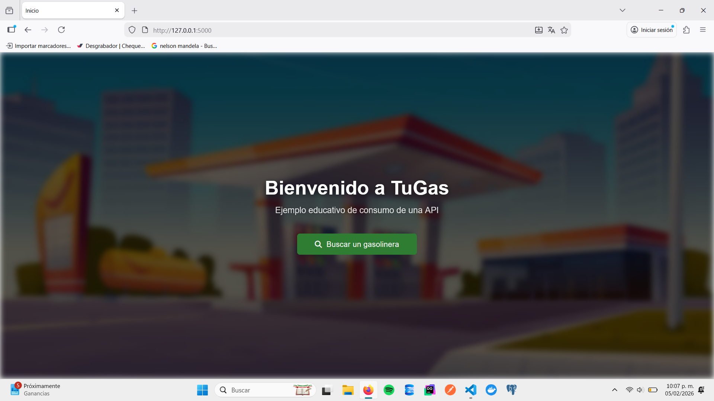
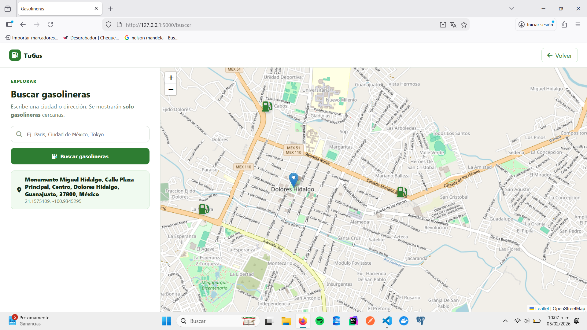

# App-API-Geolocalizacion (Gasolinerias)

## Tecnologías utilizadas
- Python
- Flask
- HTML5
- CSS

## Evidencia visual

### Pantalla principal


### Pantalla de busqueda


## Estructura del proyecto

```text
api_geolocolizacion/
│── app.py
│── templates/
│   ├── base.html
│   ├── index.html
│   └── map.html
│
├── static/
│   ├── img
│   └── css
│
├── capts/
│
└── README.md

Se creó una carpeta principal para el proyecto y se configuró un entorno virtual
para aislar las dependencias de Python.

> mkdir api_geolocolizacion
> cd api_geolocolizacion
> python -m venv venv
> venv\Scripts\activate
> pip install flask

Se utilizó un entorno virtual para instalar Flask y mantener el proyecto organizado.
Las dependencias se gestionan mediante Python y pip.

Se utilizó la API OpenStreetMap para realizar la busqueda de las gasolineras

El proyecto sigue la convención recomendada por Flask, separando:
- Backend (app.py)
- Vistas HTML (templates)
- Archivos estáticos como imágenes y hojas de estilos (static)


